# OpenCV

This repository includes basic tutorials/projects that I completed in past. I have tried to put a lot of comments to explain what is what. Hope that would be useful for you. 

What you will find is,
- Introduction to OpenCV Courses
- Mid-level tutorials
- Intermediate tutorials
- Real-world applications of OpenCV
- Image dataset manipulations
- Introduction to Image processing methods with AI
- How to train classification networks
- How to train object detection networks
- Combination of OpenCV and AI
- Official paper links for all the models and datasets that are used in all projects

Starting from the 1st of January, 2021, I will try to update the repository every day. 

## Contents:
1. [Step-by-step Installation Instructions](#step-by-step-installation-instructions)
2. [Tutorials](#tutorials)


## Sections: 
### Step-by-step Installation Instructions

Virtual Environment should be used whenever you work on any Python-based project. It is generally good to have one new virtual environment for every Python-based project you work on. So the dependencies of every project are isolated from the system and each other.

Please follow the below commands.
```bash
$ pip install virtualenv
$ virtualenv --version
$ cd [where you want to create your environment]
$ python3 -m venv opencv_tutorials
$ . opencv_tutorials/bin/activate
$ cd [where you want to clonne the repository]
$ git clone https://github.com/CoskunGorkem/OpenCV.git
$ cd OpenCV
$ pip install -r requirements.txt
```


### Tutorials

#### In that part, you will find 3 folders that contain basics, mid and intermediate levels of tutorials to learn OpenCV

##### Contents of the basics tutorial:
- [01-Introduction](https://github.com/CoskunGorkem/OpenCV/blob/main/tutorials/basics/01-Introduction.ipynb)
---
- [02-Basics](https://github.com/CoskunGorkem/OpenCV/blob/main/tutorials/basics/02-Basics.ipynb)
- 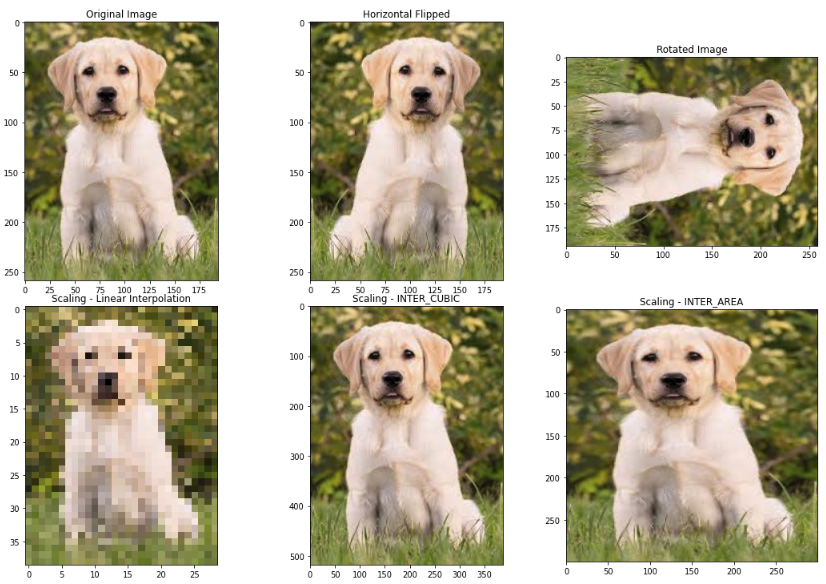
---
- [03-Basics_2](https://github.com/CoskunGorkem/OpenCV/blob/main/tutorials/basics/03-Basics_2.ipynb)
- 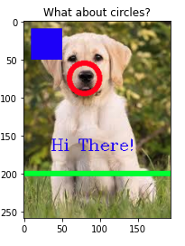
---
- [04-Kernels](https://github.com/CoskunGorkem/OpenCV/blob/main/tutorials/basics/04-Kernels.ipynb)
- 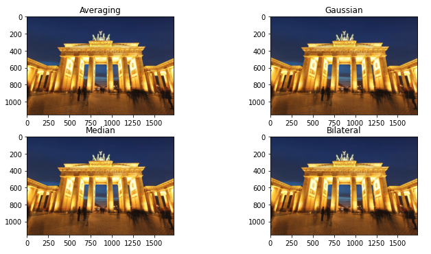
---
- [05-Kernels_2](https://github.com/CoskunGorkem/OpenCV/blob/main/tutorials/basics/05-Kernels_2.ipynb)
- 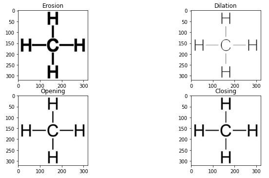
---
- [06-Camera_Input](https://github.com/CoskunGorkem/OpenCV/blob/main/tutorials/basics/06-Camera_Input.ipynb)
---
- [07-Live Sketch](https://github.com/CoskunGorkem/OpenCV/blob/main/tutorials/basics/07-Live_Sketch.ipynb)
---
- [08-Contours-Intro](https://github.com/CoskunGorkem/OpenCV/blob/main/tutorials/basics/08-Contours_Intro.ipynb)
- 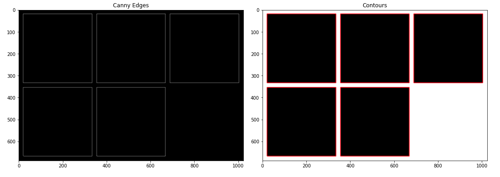
---
- [09-Contours_Sorting](https://github.com/CoskunGorkem/OpenCV/blob/main/tutorials/basics/09-Contours_Sorting.ipynb)
- 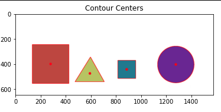
---
- [10-Contours_Shape_Detection](https://github.com/CoskunGorkem/OpenCV/blob/main/tutorials/basics/10-Contours_Shape_Detection.ipynb)
- 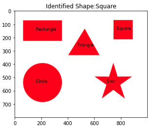
---
- [11-HoughLines](https://github.com/CoskunGorkem/OpenCV/blob/main/tutorials/basics/11-HoughLines.ipynb)
---
- [12-Image_blending](https://github.com/CoskunGorkem/OpenCV/blob/main/tutorials/basics/12-Image_blending.ipynb)
- 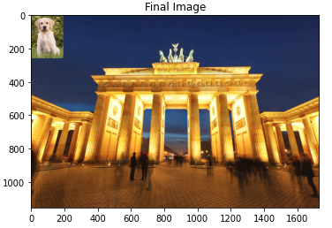
---
- [13-Image_blending_2](https://github.com/CoskunGorkem/OpenCV/blob/main/tutorials/basics/13-Image_blending_2.ipynb)
- 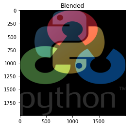
---
- [14-Mouse_Input](https://github.com/CoskunGorkem/OpenCV/blob/main/tutorials/basics/14-Mouse_Input.ipynb)
---
- [15-Mouse_Input_2](https://github.com/CoskunGorkem/OpenCV/blob/main/tutorials/basics/15-Mouse_Input_2.ipynb)
---
- [16-Color_Palette](https://github.com/CoskunGorkem/OpenCV/blob/main/tutorials/basics/16-Color_Palette.ipynb)
---
- [17-Smoothing_images](https://github.com/CoskunGorkem/OpenCV/blob/main/tutorials/basics/17-Smoothing_images.ipynb)
- 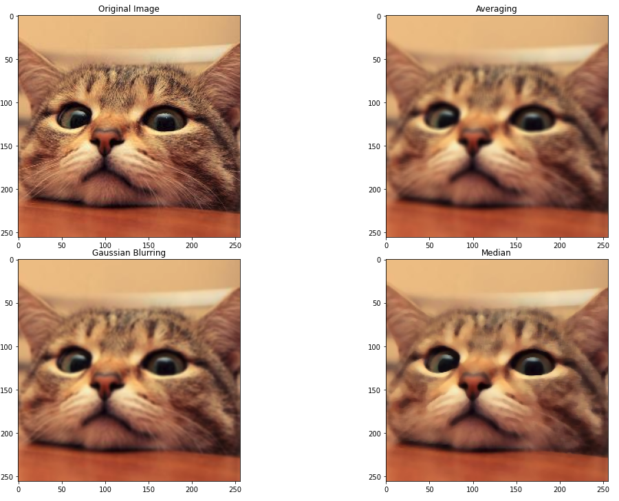

##### Mid-level tutorials will include:


- [01-Corner_detection_1](https://github.com/CoskunGorkem/OpenCV/blob/main/tutorials/mid_level/01-Corner_detection_1.ipynb)
- 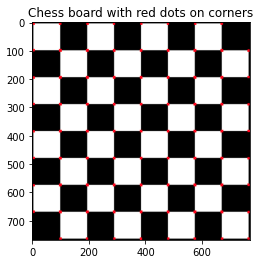
---
- [02-Corner_detection_2](https://github.com/CoskunGorkem/OpenCV/blob/main/tutorials/mid_level/02-Corner_detection_2.ipynb)
- 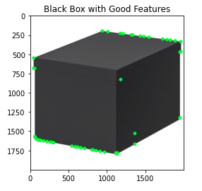
---
- [03-Introduction to FAST Algorithm for Corner Detection](https://github.com/CoskunGorkem/OpenCV/blob/main/tutorials/mid_level/03-Introduction_to_FAST_Algorithm_for_Corner_Detection.ipynb)
- 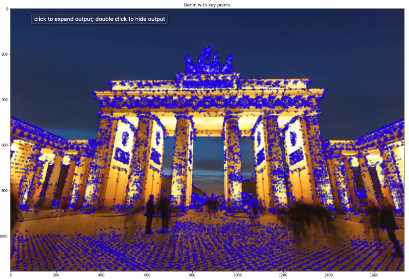
---
- [04-Introduction to SIFT (Scale-Invariant Feature Transform)](https://github.com/CoskunGorkem/OpenCV/blob/main/tutorials/mid_level/04-Introduction_to_SIFT(Scale-Invariant_Feature_Transform).ipynb)
- 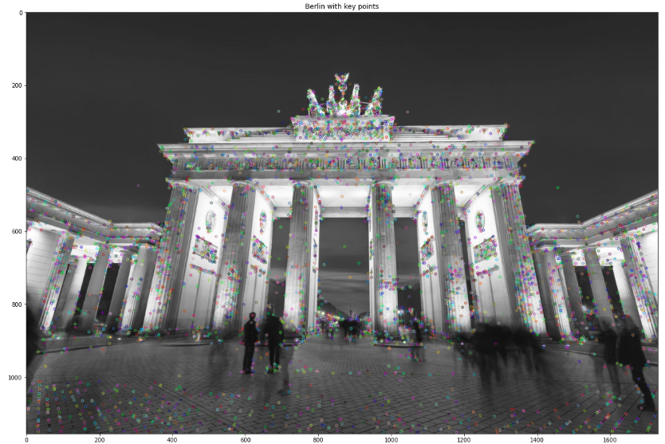
---
- [05-Feature Matching](https://github.com/CoskunGorkem/OpenCV/blob/main/tutorials/mid_level/05-Feature-Matching.ipynb)
- 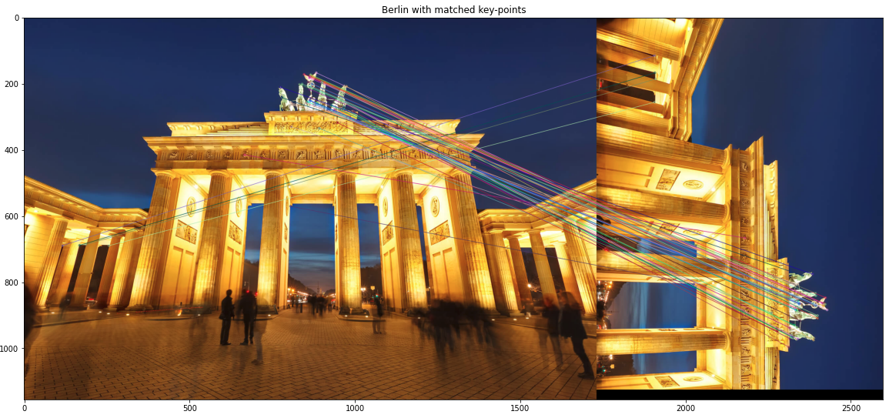
---
- [06-Feature Matching_2.ipynb](https://github.com/CoskunGorkem/OpenCV/blob/main/tutorials/mid_level/06-Feature-Matching_2.ipynb)
- 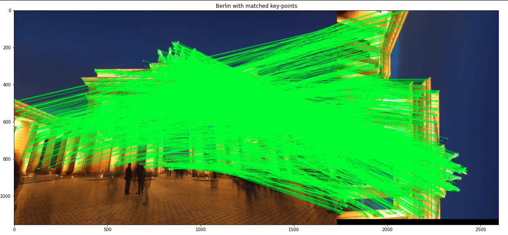


##### Intermediate tutorials will include:
-01-Introduction-to-image-classification
-02-Image-classification_2
-03-Image_classifiation_3
-04-Transfer_learning
-05-Introduction-to-object-detection

##### Projects will include daily life usage of AI and Computer vision

- 


